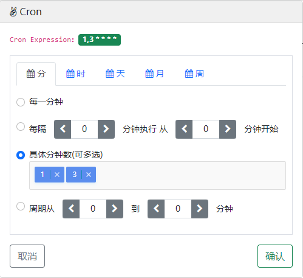

## crontab-selector
使用bootstrap popover弹窗生成cron表达式<a href="./crontab.html" alt="链接"> crontab.html</a>
***
### 一 、环境
    1、bootstrap v5.0 
    2、jquery v3.6
    ...
### 二、案例
```html
<div class="row" style="margin-top:30px;text-align:center;">
    <div class="col-4 offset-4 row">
        <div class="col-4 offset-2">
            <button type="button" class="btn btn-outline-dark" id="cronPopoverBtn">cron btn</button>
        </div>
        <div class="col-6">
            <input name="task_cron" id="task_cron" class="form-control form-control-line">
        </div>
    </div>
</div> 
```
```javascript
// start crontab-Selector
document.addEventListener("DOMContentLoaded",function(){
    // ---------------------------------------------popover start-----------------------------------------------
    // var element = document.getElementById("cronEdit"); bootstrap to model
    var element = document.getElementById("cronPopoverBtn");
    var popover = new bootstrap.Popover(element,{
        container: 'body',
        placement:'right',
        trigger:'click',
        template:'<div class="popover" role="tooltip"><div class="popover-arrow"></div><h3 class="popover-header"></h3><div class="popover-body"></div></div>',
        title:'<i class="fa fa-angellist" aria-hidden="true"></i>  Cron',
        content:$.crontabSelector(), // crontab-Selector element content
        html:true,
    });
    // choices.js add multi select
    $(document).on("click","#cronPopoverBtn",function(){
        var choices = document.querySelectorAll('.choices');
        for(var i=0; i<choices.length;i++) {
            if (choices[i].classList.contains("multiple-remove")) {
                var initChoice = new Choices(choices[i],
                {
                    delimiter: ',',
                    editItems: true,
                    maxItemCount: 60,// limit multi select length
                    removeItemButton: true,
                });
            }
            else{
                    var initChoice = new Choices(choices[i]);
                }
            }
        // show minute cron
        if($("#minute-cron").attr("class").indexOf("active") == -1){
            $("#minute-cron").addClass("show active"); 
        }
        else{
            $("#minute-cron").removeClass("show active");
        }
    });
    // ---------------------------------------------popover end-----------------------------------------------   

    // submit to get the result
    $(document).on("click","#cronSubmitBtn",function(){
        var cronExpression = [];
        $("#cronExpression").find("span").each(function(){
            cronExpression.push($(this).text().replace(" ",""));
        })
        popover.hide();
        $("#task_cron").val(cronExpression.join(" "));
        $("#td_task_cron").text(cronExpression.join(" "));
    })
    
    // close
    $(document).on("click","#cronCloseBtn",function(){
        popover.hide();
    })
});
```
### 四、结果

### 三、借鉴
    https://github.com/1615450788/vue-cron